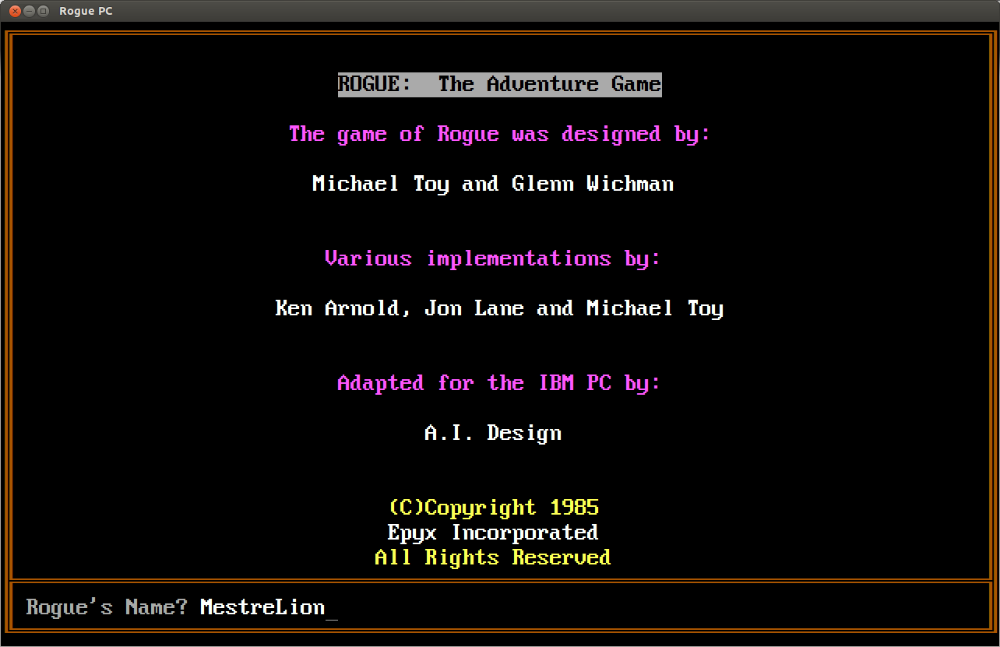
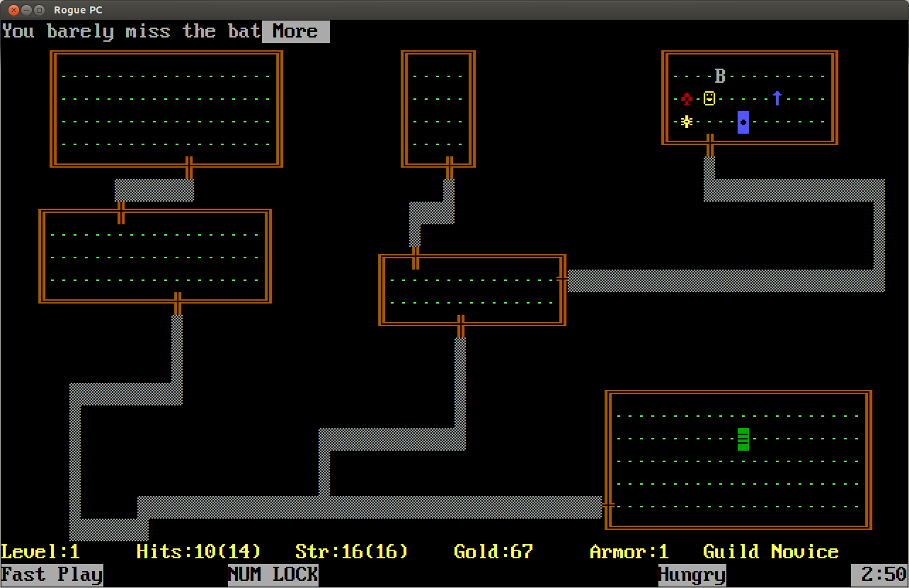
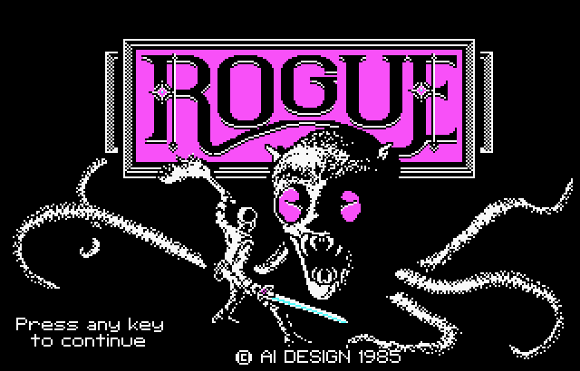

ROGUEPC
===============================================================================

### Original DOS Epyx Rogue (1985) ported to modern PCs!



<sup>*(Yes, these are actual in-game screenshots using `xterm` with the custom font)*</sup>

- Uses original source code from 1985, adapted to compile in modern PCs.
    - All comments from original authors preserved.
    - All changes needed for portability from 16-bit DOS fully marked and explained.
    - Extensive documentation on original code inner mechanics:
      hardware access, BIOS and DOS INT calls, clock and timers, CGA/EGA graphics usage,
      piracy copy protection, splash image, assembly routines, builtin `curses`, etc.
    - Great care taken to preserve as much as possible from original. More than 85% still intact!
- Strictly adheres to POSIX C and ISO C99 standards to be fully portable to any platform.
- Runs in any terminal, text-only, using nothing but `curses`, just like the original.
- Colors and gameplay intact.
- Non-ASCII characters updaded from DOS CP437 to suitable Unicode codepoints.


<sup>*(Better get used to, you'll see this... a **lot**)*</sup>

For Debian / Ubuntu systems:
```sh
sudo apt install libncursesw5-dev
cd src
make
./rogue
```

For ASCII mode (like UNIX Rogue, but with colors):
```sh
sudo apt install libncurses5-dev
cd src
make ROGUE_CHARSET=1
./rogue
```

Strongly suggested:
- Install the custom `PerfectDOSVGA437Unicode.ttf` font. See [tools](tools/)
- If `xterm` is available, run using [`roguepc-xterm`](roguepc-xterm)



<sup>*(Sorry, the CGA splash image is not really used in-game. **Yet.**)*</sup>
